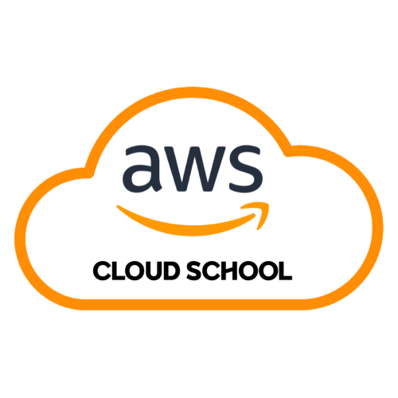

# AWeSome Web Maker 

> ### Introduction
> 
> **Mario Sisters** is a collaborative project from AWS Cloud School Bootcamp. The purpose of this project is to practice Istio, an open-source service mesh platform used to manage microservices.
>
> 마리오 브라더스를 하면 고소를 당할 거 같았던 그들은 마리오 시스터즈로 가기로 한다